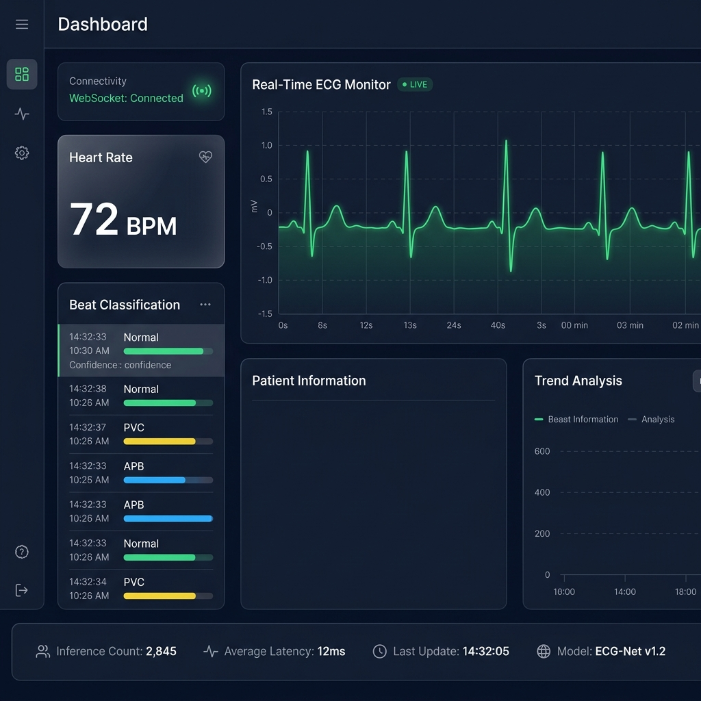
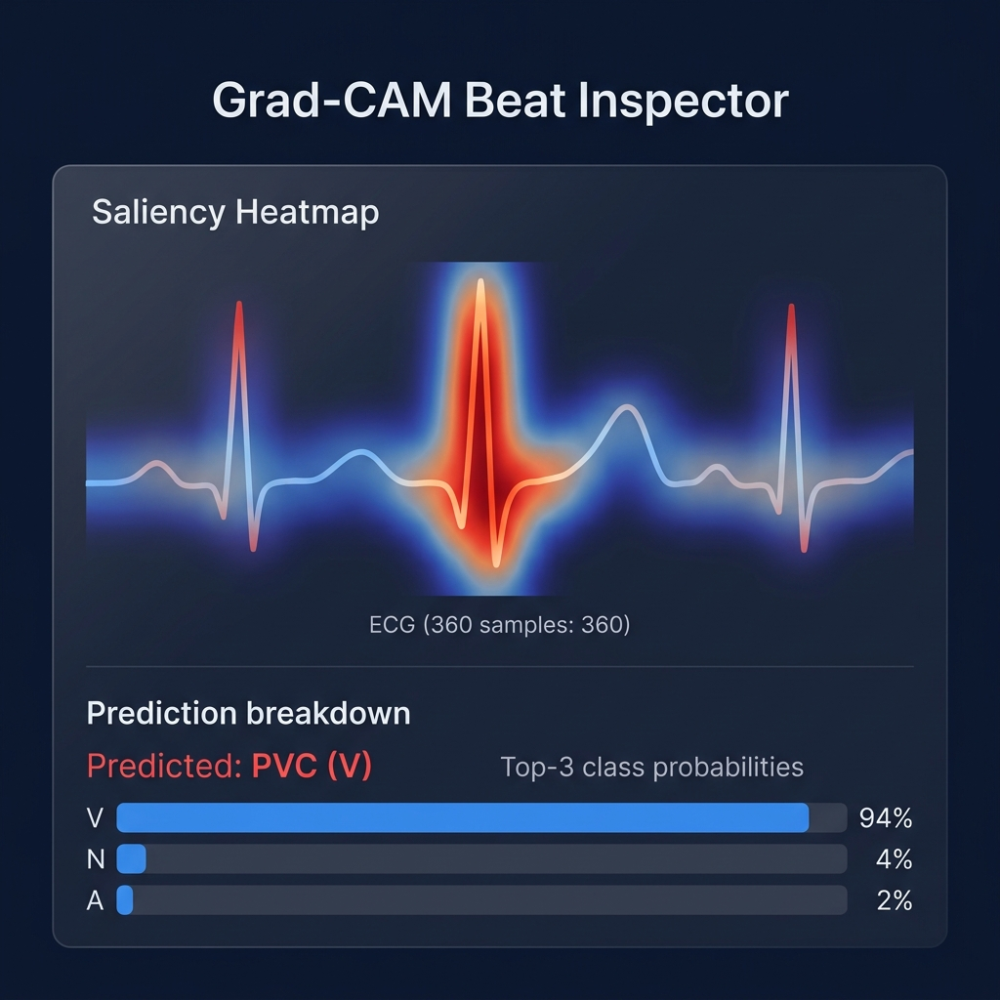
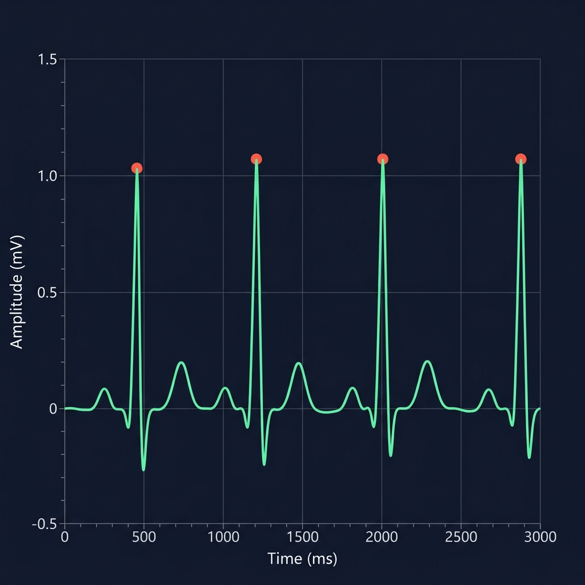
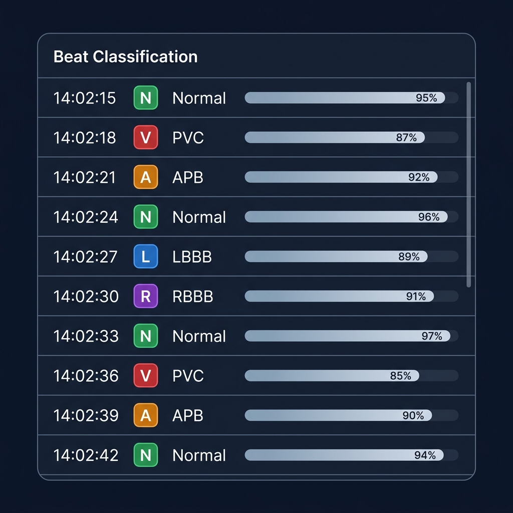
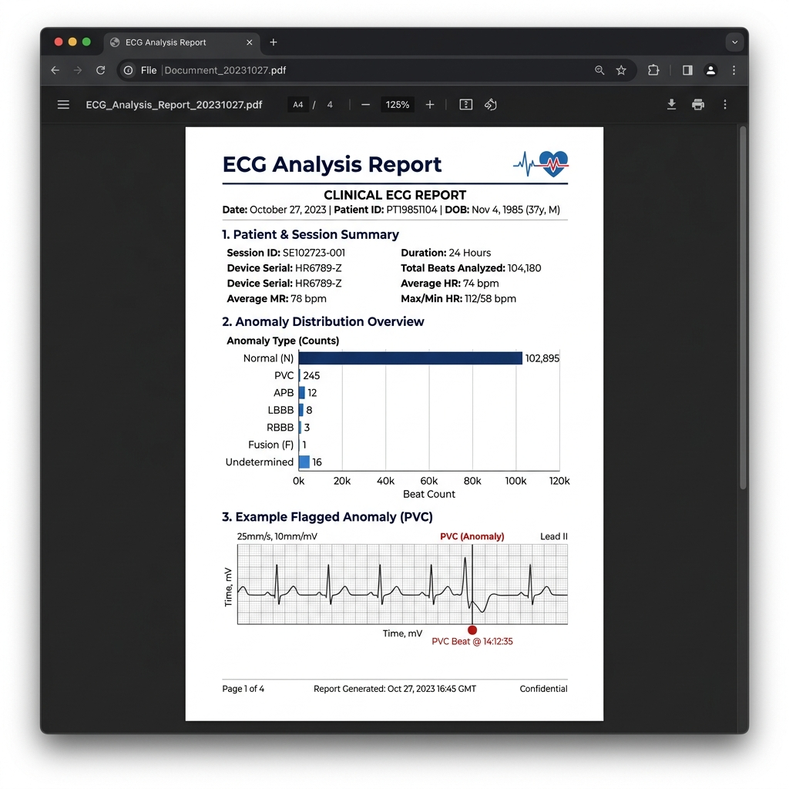
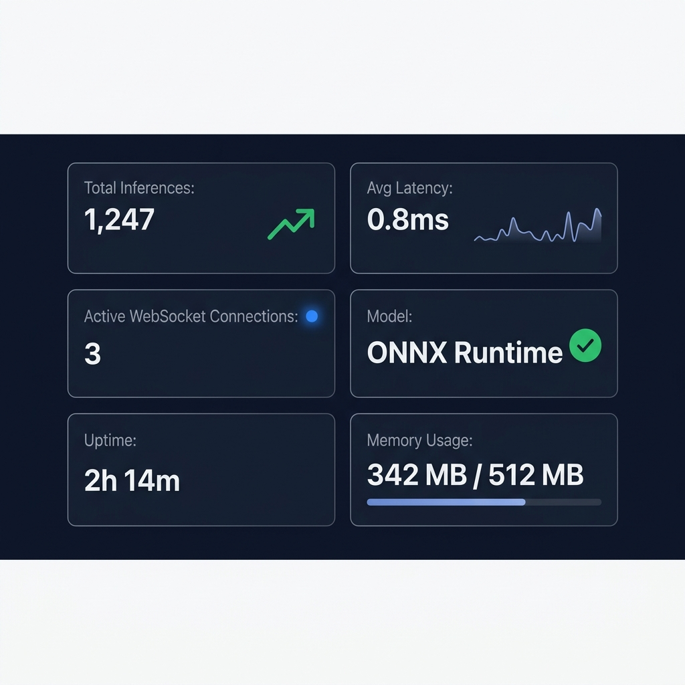
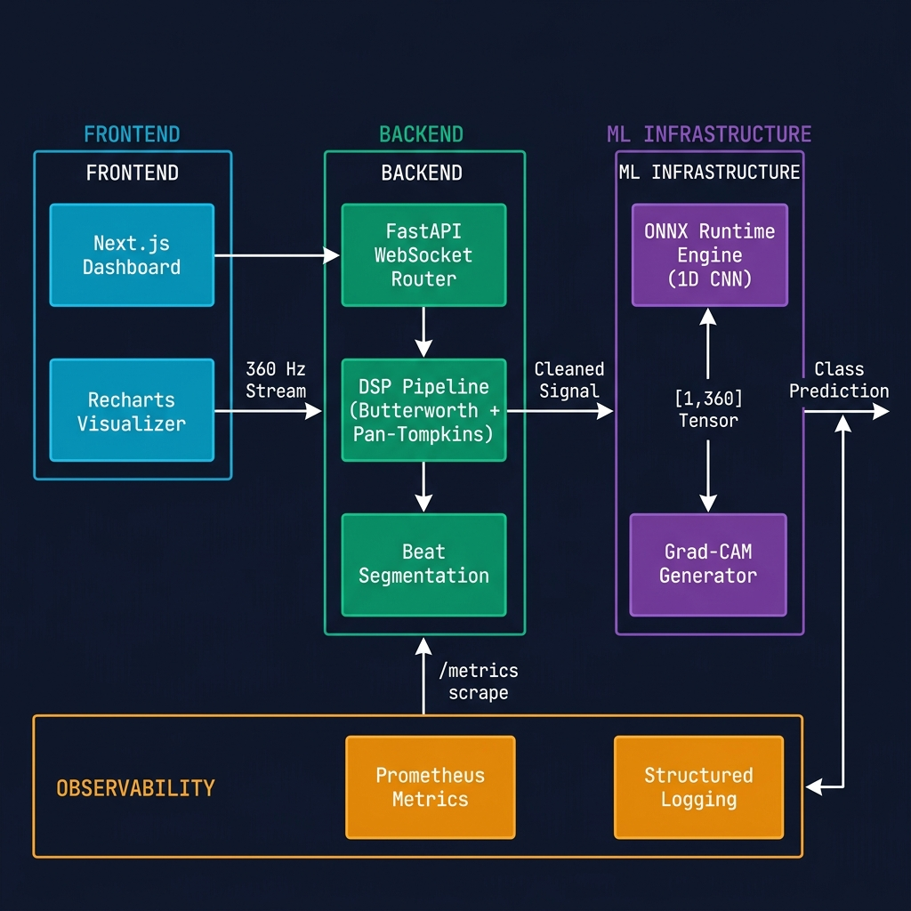
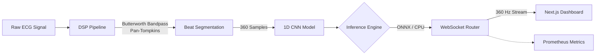

# Real-Time AI-Driven ECG Arrhythmia Analysis Platform

> **Accelerating clinical diagnosis of cardiac arrhythmias through low-latency deep learning and real-time observability.**

[](#)
[](#)
[](#)
[](#)
[](#)

## Visuals & Features

<table>
  <tr>
    <td width="50%">
      
      <br>
      <em>Real-time interactive dashboard visualizing high-frequency ECG streaming, active rhythm classification, and anomaly scoring.</em>
    </td>
    <td width="50%">
      
      <br>
      <em>Clinical-grade explainability using Grad-CAM to highlight the exact morphological features driving model predictions.</em>
    </td>
  </tr>
  <tr>
    <td width="50%">
      
      <br>
      <em>360 Hz live telemetry rendering with Pan-Tompkins R-peak detection highlighting dynamic cardiac cycles.</em>
    </td>
    <td width="50%">
      
      <br>
      <em>Continuous beat-by-beat classification achieving sub-millisecond inference across 5 AAMI clinical categories.</em>
    </td>
  </tr>
  <tr>
    <td width="50%">
      
      <br>
      <em>Automated clinical summary report generation via Pydantic-validated PDF streaming.</em>
    </td>
    <td width="50%">
      
      <br>
      <em>Hardened backend observability exposing real-time inference latency, queue depth, and memory telemetry.</em>
    </td>
  </tr>
</table>

**System Architecture:**


<br>
<em>End-to-end system architecture from high-frequency ingestion to edge-optimized ONNX CPU inference.</em>

## Overview

Diagnosing cardiac arrhythmias from high-frequency continuous telemetry remains a computationally expensive and latency-sensitive clinical challenge. This platform solves this by combining digital signal processing (Butterworth + Pan-Tompkins) with a 1D Convolutional Neural Network deployed on an optimized ONNX CPU runtime. The system processes raw ECG streams via real-time WebSockets at 360 Hz, achieving sub-millisecond per-beat inference while exposing deep clinical explainability through Grad-CAM saliency mapping and comprehensive PDF reporting.

## Live Demo

- **Live Platform URL:** [Deploying Soon]
- **Video Walkthrough:** [Link to Demo Video]

## Features

- **360 Hz WebSocket Streaming:** Sub-millisecond latency telemetry visualization via Next.js and Recharts.
- **Robust DSP Preprocessing:** Butterworth bandpass filtering (0.5–40Hz) isolates clinical morphology from noise.
- **Dynamic Beat Segmentation:** Pan-Tompkins R-peak detection aligns and centers dynamic 360-sample heartbeat windows.
- **5-Class Arrhythmia Detection:** Classifies N, V, A, L, and R beats compliant with AAMI clinical reporting standards.
- **ONNX Inference Acceleration:** Pytorch weights statically compiled to ONNX for low-overhead, thread-safe CPU execution.
- **Grad-CAM Saliency Maps:** Visualizes layer-specific convolutional activations to mathematically justify predictions.
- **Prometheus Telemetry:** Hardened backend exposes real-time inference latency, queue depth, and memory metrics.
- **Automated PDF Generation:** Pydantic-validated REST endpoint streams styled, self-contained clinical summary reports.
- **Containerized Architecture:** Fully isolated Docker environment enabling cold-start execution in under 60 seconds.
- **Production CI/CD Pipeline:** Enforces 80%+ backend coverage, strict TypeScript linting, and Next.js SSR hydration checks.

## System Architecture



The system ingests continuous ECG streams, isolating distinct beats via Pan-Tompkins DSP. The segmented 360-sample arrays are piped through a thread-safe ONNX Runtime environment, yielding predictions that are immediately emitted across a WebSocket buffer to the Next.js React frontend.

## ML Pipeline

```python
# The clinical beat extraction and prediction pipeline:
raw_signal = receive_socket_buffer()
filtered_signal = apply_butterworth_bandpass(raw_signal, lowcut=0.5, highcut=40.0, fs=360)
r_peaks = pan_tompkins_detect(filtered_signal, fs=360)

for peak in r_peaks:
    # 360 samples centered on the R-peak
    segment = extract_beat_window(filtered_signal, peak, window_size=360) 
    normalized_segment = z_score_normalize(segment)
    
    # Thread-safe ONNX prediction
    tensor = to_numpy_tensor(normalized_segment)
    probabilities = onnx_session.run(None, {input_name: tensor})[0]
    predicted_class = argmax(probabilities)
```

## Tech Stack

| Frontend | Backend | ML & Infrastructure |
| :--- | :--- | :--- |
| Next.js (App Router) | FastAPI | PyTorch & ONNX Runtime |
| React Testing Library | Uvicorn & WebSockets | Prometheus & loguru |
| Recharts & TailwindCSS | Pydantic-Settings | Docker & GitHub Actions |
| Jest | Pytest | Render & Vercel |

## Quick Start

```bash
git clone https://github.com/pr6thv3/ecg-ai-platform.git
cd ecg-ai-platform
docker compose up --build
```

## API Endpoints

| Method | Endpoint | Description | Example Response |
| :--- | :--- | :--- | :--- |
| `GET` | `/health` | System uptime and ONNX model status. | `{"status": "ok", "model_loaded": true}` |
| `GET` | `/metrics` | Prometheus metrics scrape target. | `# HELP ecg_inferences_total...` |
| `POST` | `/analyze` | Synchronous static ECG segment analysis. | `{"class": "V", "confidence": 0.98}` |
| `POST` | `/explain` | Grad-CAM saliency map for a given beat. | `{"saliency": [0.1, 0.5, ... 0.0]}` |
| `POST` | `/report/generate` | Generates a clinical PDF summary. | `(Binary PDF Stream)` |
| `WS` | `/ws/ecg-stream` | Bidirectional 360 Hz stream telemetry. | `{"type": "telemetry", "bpm": 72}` |

## Model Performance

*Evaluated on the held-out MIT-BIH Arrhythmia Database test split.*

| Class | Type | Precision | Recall | F1-Score | Support |
| :--- | :--- | :--- | :--- | :--- | :--- |
| **N** | Normal | 0.98 | 0.99 | 0.98 | ~90,000 |
| **V** | PVC | 0.94 | 0.95 | 0.94 | ~7,000 |
| **A** | APB | 0.89 | 0.81 | 0.85 | ~2,500 |
| **L** | LBBB | 0.99 | 0.98 | 0.98 | ~8,000 |
| **R** | RBBB | 0.97 | 0.98 | 0.98 | ~7,000 |


## Benchmarks

| Runtime | Mean Latency (ms) | Beats/sec |
| :--- | :--- | :--- |
| **PyTorch** | [RUN: pytest scripts/benchmark_inference.py] | [RUN: pytest scripts/benchmark_inference.py] |
| **ONNX** | [RUN: pytest scripts/benchmark_inference.py] | [RUN: pytest scripts/benchmark_inference.py] |

For full benchmarking methodology and system metrics, see the [Full Benchmarks Report](docs/benchmarks.md).

## Testing

| Module | Target | Current Coverage |
| :--- | :--- | :--- |
| Backend (`backend/`) | 80% | [RUN: pytest --cov=backend] |
| Frontend (`frontend/`) | 80% | [RUN: npm run test:coverage] |

```bash
# Run Backend Tests
pytest --cov=backend

# Run Frontend Tests
npm run test
```

## Deployment

- **Backend:** Configured for [Render](https://render.com) Web Services via `render.yaml`.
- **Frontend:** Configured for seamless Next.js deployment to [Vercel](https://vercel.com).

## Limitations

- **Single-Lead Analysis:** The model currently only evaluates MLII single-lead geometry and cannot interpret multi-axis spatial pathologies.
- **Simulated WebSocket Demo:** For demonstration purposes, the live UI streams cached MIT-BIH records via simulated websocket buffering rather than capturing real physical hardware output.
- **Motion Artifact Susceptibility:** Extreme baseline wander resulting from intense physical patient motion may overcome the bounds of the Butterworth filter, leading to misclassification.
- **CPU Bound:** Current deployment leverages ONNX CPU runtime. High concurrent scale limits are bound to multi-processing rather than tensor parallelism.

## Disclaimer

**This project is for educational and research demonstration only. Not intended for clinical diagnosis, treatment, or patient monitoring.**

## Future Work

- Expanding the architecture to support spatial 12-lead ECG tensor inputs.
- Integration with edge-compute wearable microcontrollers via MQTT protocols.
- Migrating the monolithic model structure to a federated learning architecture for multi-hospital collaboration.
- Exposing the DSP pipeline in Rust for maximum memory-safe signal throughput.
- Integrating LLM-driven conversational interfaces for localized report Q&A.

## Citation

If you use this codebase or architecture in your research, please cite:

```bibtex
@software{ecg_ai_platform_2026,
  author = {Preethve},
  title = {Real-Time AI-Driven ECG Arrhythmia Analysis Platform},
  year = {2026},
  url = {https://github.com/pr6thv3/ecg-ai-platform}
}
```
