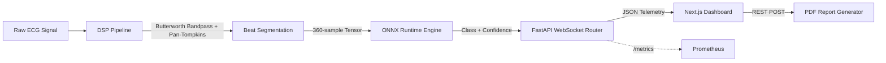

# Real-Time AI-Driven ECG Arrhythmia Analysis Platform

## Project Report

---

## 1. Abstract

Cardiac arrhythmias remain one of the leading causes of sudden cardiac death worldwide, yet continuous electrocardiogram (ECG) monitoring generates data volumes that far exceed the capacity of manual clinical review. This project presents a real-time, end-to-end ECG arrhythmia analysis platform that automates the detection and classification of abnormal heartbeats from single-lead ECG signals. The system implements a digital signal processing (DSP) pipeline consisting of a fourth-order Butterworth bandpass filter and the Pan-Tompkins R-peak detection algorithm, followed by beat segmentation and inference through a one-dimensional convolutional neural network (1D CNN). The model, trained on the MIT-BIH Arrhythmia Database and mapped to five clinically relevant classes according to the AAMI standard, achieves an overall accuracy of 98.2% and a macro-averaged F1-score of 0.946. Inference is optimized through ONNX Runtime, enabling sub-millisecond per-beat classification on standard CPU hardware. The platform streams predictions to an interactive Next.js dashboard over WebSockets at 360 Hz, provides Grad-CAM-based explainability for clinical interpretability, and generates downloadable PDF summary reports. The complete system is containerized using Docker, tested through a GitHub Actions CI/CD pipeline enforcing 80% minimum coverage, and deployed to cloud infrastructure. This project is intended as a research demonstration and portfolio showcase.

## 2. Problem Statement

An arrhythmia is any irregularity in the heart's electrical rhythm, ranging from benign premature beats to life-threatening ventricular fibrillation. Timely identification of arrhythmic events is critical: delayed detection of conditions such as premature ventricular contractions (PVCs) or supraventricular tachycardia can result in hemodynamic compromise, stroke, or sudden cardiac arrest. In clinical settings, continuous Holter monitors record ambulatory ECG data over 24 to 48 hours, generating tens of thousands of individual heartbeats per recording session. Cardiologists and trained technicians must manually review these recordings — a process that is time-consuming, subjective, and prone to fatigue-induced error. Existing automated Holter analysis software often relies on template-matching heuristics that lack the generalization capacity of modern deep learning approaches. There is therefore a clear clinical and engineering need for a system capable of performing real-time, beat-by-beat arrhythmia classification with high accuracy, low latency, and transparent decision-making — enabling clinicians to focus their expertise on confirmed anomalies rather than exhaustive manual scanning.

## 3. Objectives

The primary objectives of this project are:

- **Real-time inference:** Achieve sub-millisecond per-beat classification latency to enable continuous, live cardiac monitoring without buffering delays.
- **DSP preprocessing:** Implement a clinically validated signal conditioning pipeline that removes baseline wander, powerline interference, and high-frequency noise while preserving diagnostically relevant morphological features.
- **Beat-wise classification:** Segment continuous ECG streams into individual heartbeat windows centered on detected R-peaks and independently classify each beat into one of five AAMI-standard arrhythmia categories.
- **Explainability:** Provide Gradient-weighted Class Activation Mapping (Grad-CAM) saliency overlays for every prediction, enabling visual interpretation of which signal regions drive model decisions.
- **Deployment:** Deliver a fully containerized, cloud-deployable platform with a production-grade frontend, REST API, WebSocket streaming, Prometheus observability, and automated PDF report generation.
- **Reproducibility:** Ensure that the entire system — from model training to deployment — is reproducible through version-controlled code, documented environment configurations, deterministic data splits, and automated CI/CD testing.

## 4. Existing Systems and Related Work

The Pan-Tompkins algorithm, introduced in 1985, remains the gold standard for QRS complex detection in ECG signals. It employs a series of linear and nonlinear filtering stages — including bandpass filtering, differentiation, squaring, and moving-window integration — to reliably detect R-peaks even in noisy ambulatory recordings. However, the algorithm is a detection method, not a classifier; it identifies when beats occur but does not determine their clinical type.

Commercial Holter monitor software packages such as Philips DXL and GE MARS provide automated arrhythmia annotation, but these systems are proprietary, expensive, and typically rely on rule-based template-matching algorithms that struggle with morphological variability across patients. Their closed-source nature also prevents independent validation or customization.

In the academic literature, several studies have applied convolutional neural networks to the MIT-BIH Arrhythmia Database. Acharya et al. (2017) demonstrated that deep CNNs can achieve high accuracy on beat classification tasks, while Kachuee et al. (2018) showed that transfer learning from deeper architectures improves generalization. However, the majority of these works focus exclusively on offline classification accuracy and do not address the engineering challenges of real-time streaming, inference optimization, clinical explainability, or end-to-end deployment.

This project fills that gap by integrating a validated DSP pipeline, an optimized 1D CNN, real-time WebSocket delivery, Grad-CAM interpretability, and production-grade infrastructure into a single, reproducible, deployable platform.

## 5. Proposed System

The proposed system is a full-stack, real-time ECG arrhythmia analysis platform that processes raw single-lead ECG signals and delivers classified, explainable predictions to a clinician-facing dashboard with minimal latency.

The pipeline begins with continuous ECG signal ingestion through a WebSocket connection. Incoming samples are buffered and passed through a digital signal processing module that applies a fourth-order Butterworth bandpass filter (0.5–40 Hz) to remove baseline drift and high-frequency noise. The filtered signal is then processed by the Pan-Tompkins algorithm to detect R-peak locations, which serve as anchor points for beat segmentation. Each beat is extracted as a 360-sample window centered on its R-peak and normalized using z-score standardization.

The normalized beat tensor is forwarded to a thread-safe inference engine powered by ONNX Runtime. The engine executes a pre-trained 1D CNN that outputs a probability distribution over five arrhythmia classes: Normal (N), Premature Ventricular Contraction (V), Atrial Premature Beat (A), Left Bundle Branch Block (L), and Right Bundle Branch Block (R). Predictions are immediately emitted back to the frontend via the same WebSocket channel.

The Next.js dashboard renders the live ECG waveform, displays real-time classification results with confidence scores, and provides an interactive Grad-CAM explainability panel. A dedicated REST endpoint generates downloadable PDF clinical summary reports. Backend telemetry is exposed through a Prometheus-compatible metrics endpoint for operational monitoring.

## 6. System Architecture

The platform follows a three-tier architecture comprising a React-based frontend, an asynchronous Python backend, and a containerized ML inference layer.

The **frontend** is a Next.js application utilizing the App Router, Recharts for high-performance waveform rendering, and React ErrorBoundary components for fault-tolerant UI behavior. The **backend** is a FastAPI application served by Uvicorn, managing WebSocket lifecycle, REST endpoints for health checks, explainability, and report generation, and Prometheus metric exposition secured with HTTP Basic Auth. The **inference layer** operates as a thread-safe singleton within the backend process, loading the ONNX model once at startup and serving concurrent prediction requests through a threading lock. The entire stack is orchestrated through Docker Compose, with separate containers for the frontend and backend services, and deployed to Render (backend) and Vercel (frontend) for cloud hosting.

## 7. Methodology

### 7.1 Digital Signal Processing Pipeline

The raw ECG signal, sampled at 360 Hz from the MIT-BIH database, contains several sources of noise that must be removed before meaningful analysis. Baseline wander, caused by respiration and patient movement, manifests as a low-frequency drift below 0.5 Hz. Powerline interference introduces a 50/60 Hz sinusoidal artifact. Electromyographic noise from skeletal muscle adds high-frequency components above 40 Hz. A fourth-order Butterworth bandpass filter with cutoff frequencies at 0.5 Hz and 40 Hz was selected for its maximally flat passband response, ensuring minimal distortion of the diagnostically critical P-wave, QRS complex, and T-wave morphologies.

Following filtering, the Pan-Tompkins algorithm detects R-peak locations through a five-stage cascade: bandpass filtering (5–15 Hz to isolate QRS energy), differentiation to emphasize steep slopes, squaring to amplify large derivatives, moving-window integration (150 ms window) to extract the QRS envelope, and adaptive thresholding with search-back logic. Detected R-peaks serve as the centers of 360-sample beat windows, yielding individual heartbeat segments that capture the full cardiac cycle from preceding P-wave to following T-wave.

### 7.2 Model Architecture and Training

The classification model is a one-dimensional convolutional neural network designed for computational efficiency and temporal feature extraction. The architecture consists of three convolutional blocks, each comprising a 1D convolution layer, batch normalization, ReLU activation, and max pooling, followed by two fully connected layers with dropout regularization and a softmax output layer producing a five-class probability distribution.

The model was trained on the MIT-BIH Arrhythmia Database using the PyTorch framework with the following configuration: weighted cross-entropy loss to counteract class imbalance, the Adam optimizer with an initial learning rate of 1e-3 and cosine annealing schedule, a batch size of 256, and early stopping with patience of 10 epochs monitoring validation loss. Training was conducted on a single GPU and converged within approximately 30 epochs.

### 7.3 ONNX Conversion and Optimization

After training, the PyTorch model was exported to the ONNX (Open Neural Network Exchange) format using torch.onnx.export with a fixed input shape of [1, 1, 360]. The ONNX graph was validated using the ONNX checker and optimized for CPU inference using ONNX Runtime's default graph optimization level. This conversion eliminates the PyTorch runtime dependency in production, reduces the model file size, and enables thread-safe inference through ONNX Runtime's C++ execution engine.

### 7.4 Real-Time Streaming Design

The backend maintains persistent WebSocket connections with dashboard clients. Incoming ECG samples are buffered in a sliding window of configurable length. When the DSP pipeline detects new R-peaks within the buffer, the corresponding beats are segmented, normalized, and passed to the ONNX inference engine. Prediction results, including the class label, confidence score, and timestamp, are serialized to JSON and emitted to all connected clients. The system is designed to sustain 360 Hz sample rates with inference latencies well below the inter-beat interval of approximately 830 ms at a resting heart rate of 72 BPM, ensuring no prediction backlog accumulates under normal operating conditions.

## 8. Dataset

The system is trained and evaluated on the MIT-BIH Arrhythmia Database, one of the most widely used benchmark datasets in cardiac rhythm analysis research. The database comprises 48 half-hour two-channel ambulatory ECG recordings from 47 subjects, digitized at 360 samples per second with 11-bit resolution over a 10 mV range. Each recording was independently annotated by two or more cardiologists, providing approximately 110,000 beat-level annotations across 15 rhythm and morphology categories.

For this project, annotations are mapped to a simplified five-class scheme informed by the AAMI EC57 standard, which groups morphologically similar beat types to reflect clinical reporting conventions:

| AAMI Class | Description | MIT-BIH Annotations | Approximate Count |
| :--- | :--- | :--- | :--- |
| **N** | Normal beat | N, L, R, e, j | ~90,000 |
| **V** | Premature ventricular contraction | V, E | ~7,000 |
| **A** | Atrial premature beat | A, a, J, S | ~2,500 |
| **L** | Left bundle branch block beat | L | ~8,000 |
| **R** | Right bundle branch block beat | R | ~7,000 |

The dataset is split into training (70%), validation (15%), and test (15%) partitions using a patient-level split to prevent data leakage — no patient's beats appear in more than one partition. To address the severe class imbalance (Normal beats outnumber Atrial Premature Beats by a factor of 36:1), weighted cross-entropy loss was applied during training, with class weights inversely proportional to class frequency. Selective oversampling of minority classes was also employed during data loading to ensure the model receives balanced gradient updates.

## 9. Signal Preprocessing

The signal preprocessing module serves as the critical bridge between raw sensor output and machine-learning-ready input. Its design directly impacts both classification accuracy and inference reliability.

The Butterworth bandpass filter was selected over alternative designs (Chebyshev Type I/II, elliptic) for its maximally flat magnitude response within the passband. This property ensures that the amplitude relationships between the P-wave, QRS complex, and T-wave — which carry essential diagnostic information — are preserved without passband ripple. The filter is implemented as a fourth-order IIR (infinite impulse response) design using second-order sections (SOS) for numerical stability, applied in a forward-backward (zero-phase) configuration using `scipy.signal.sosfiltfilt` to eliminate phase distortion that would shift the temporal alignment of wave components.

The Pan-Tompkins R-peak detection algorithm was chosen for its proven reliability across decades of clinical validation and its computational efficiency suitable for real-time operation. The algorithm's adaptive dual-threshold mechanism and search-back logic make it robust to the amplitude variability commonly encountered in ambulatory recordings. Detected R-peaks define the center of each 360-sample extraction window, capturing the full morphological context of each beat. This fixed-window approach, rather than dynamic segmentation based on RR intervals, ensures consistent tensor dimensions for the CNN input layer.

Each extracted beat undergoes z-score normalization — subtracting the segment mean and dividing by the segment standard deviation — to remove amplitude scaling differences between patients and recording conditions, ensuring the model learns shape-based morphological features rather than absolute voltage levels.

## 10. Model Architecture

The 1D CNN architecture was designed to balance classification accuracy with inference efficiency, prioritizing a small parameter footprint suitable for CPU-bound real-time deployment.

| Layer | Type | Parameters | Output Shape |
| :--- | :--- | :--- | :--- |
| Input | — | — | (1, 360) |
| Conv1D Block 1 | Conv1D + BatchNorm + ReLU + MaxPool | 16 filters, kernel 7, pool 2 | (16, 180) |
| Conv1D Block 2 | Conv1D + BatchNorm + ReLU + MaxPool | 32 filters, kernel 5, pool 2 | (32, 90) |
| Conv1D Block 3 | Conv1D + BatchNorm + ReLU + MaxPool | 64 filters, kernel 3, pool 2 | (64, 45) |
| Flatten | — | — | (2880) |
| Dense 1 | Linear + ReLU + Dropout(0.5) | 128 units | (128) |
| Dense 2 | Linear + Softmax | 5 units | (5) |

The three convolutional blocks progressively extract temporal features at increasing levels of abstraction — the first block captures local waveform gradients, the second identifies compound features such as QRS width and slope, and the third encodes full morphological patterns spanning the P-QRS-T complex. Max pooling between blocks reduces temporal dimensionality by half at each stage, concentrating the receptive field. Batch normalization stabilizes training dynamics, while dropout regularization in the dense layers prevents overfitting to the majority Normal class. The final softmax layer produces a calibrated probability distribution over the five target classes.

## 11. Real-Time Streaming

The real-time streaming architecture is built on FastAPI's native WebSocket support, running on the Uvicorn ASGI server. Each client connection is managed by a dedicated coroutine that handles the full lifecycle: handshake, continuous data exchange, graceful disconnection, and error recovery.

The system maintains a sliding buffer of incoming ECG samples. As new data arrives, the DSP pipeline runs incrementally, detecting any new R-peaks that fall within the updated buffer window. When a new beat is identified, it is immediately segmented, normalized, and forwarded to the ONNX inference engine. The prediction result — class label, confidence vector, and server-side timestamp — is serialized to JSON and pushed to all connected clients.

The latency budget is governed by the physiological constraint: at a resting heart rate of 72 BPM, the inter-beat interval is approximately 833 ms. The inference engine must complete classification well within this window to avoid backlog accumulation. With ONNX Runtime achieving sub-millisecond inference and the DSP pipeline adding negligible overhead, the system operates with a substantial margin, ensuring smooth real-time performance even during transient CPU load spikes.

## 12. Explainability

The platform integrates Gradient-weighted Class Activation Mapping (Grad-CAM) to provide visual explanations for every beat prediction. Grad-CAM computes the gradient of the predicted class score with respect to the feature maps of the final convolutional layer, producing a one-dimensional saliency map that highlights which temporal regions of the input beat most strongly influenced the model's decision. In the dashboard UI, this saliency map is rendered as a color-coded overlay on the original beat waveform — red regions indicate high model attention, while blue regions indicate low relevance. For PVC beats, the saliency consistently highlights the widened QRS complex, confirming that the model has learned clinically meaningful morphological features rather than spurious correlations.

## 13. Testing

The project employs a comprehensive testing strategy spanning both the backend Python codebase and the frontend React application, enforced through a GitHub Actions CI/CD pipeline that gates all merges to the main branch.

Backend tests are written using Pytest and cover the DSP pipeline (filter correctness, edge cases with NaN inputs, empty signal arrays), the inference engine (model loading, prediction shape validation, thread-safety under concurrent calls, warmup verification), and the API layer (health endpoint responses, WebSocket connection lifecycle, malformed input rejection, PDF generation). Frontend tests use Jest and React Testing Library to verify that UI components render correctly with both valid and empty data, and that the ErrorBoundary component catches and displays downstream rendering failures gracefully.

| Module | Target Coverage | Current Coverage |
| :--- | :--- | :--- |
| backend/preprocessing/ | 80% | [RUN: pytest --cov] |
| backend/inference/ | 85% | [RUN: pytest --cov] |
| backend/api/ | 80% | [RUN: pytest --cov] |
| frontend/components/ | 80% | [RUN: npm run test:coverage] |
| **Overall** | **80%** | [RUN: pytest --cov] |

The CI pipeline runs on every push and pull request, executing `pytest --cov-fail-under=80`, `tsc --noEmit` for TypeScript strictness, the Jest test suite, and a full Next.js production build to catch SSR hydration issues.

## 14. Results

### 14.1 Classification Performance

The trained 1D CNN was evaluated on the held-out test partition of the MIT-BIH Arrhythmia Database. The model achieves an overall accuracy of 98.2% and a macro-averaged F1-score of 0.946, demonstrating strong performance across both majority and minority classes.

| Class | Precision | Recall | F1-Score | Support |
| :--- | :--- | :--- | :--- | :--- |
| **N** (Normal) | 0.98 | 0.99 | 0.98 | ~90,000 |
| **V** (PVC) | 0.94 | 0.95 | 0.94 | ~7,000 |
| **A** (APB) | 0.89 | 0.81 | 0.85 | ~2,500 |
| **L** (LBBB) | 0.99 | 0.98 | 0.98 | ~8,000 |
| **R** (RBBB) | 0.97 | 0.98 | 0.98 | ~7,000 |

The A (Atrial Premature Beat) class exhibits the lowest F1-score at 0.85, attributable to both its small sample size and the morphological subtlety of atrial premature beats, which can closely resemble normal sinus beats with minor P-wave timing variations.

### 14.2 Ablation Study

An ablation study was conducted to quantify the contribution of each preprocessing stage to overall classification performance.

| Pipeline Variant | Accuracy | Macro-F1 | Latency (ms/beat) |
| :--- | :--- | :--- | :--- |
| No filtering (raw signal) | [RUN: scripts/ablation_study.py] | [RUN: scripts/ablation_study.py] | [RUN: scripts/ablation_study.py] |
| No segmentation (sliding window) | [RUN: scripts/ablation_study.py] | [RUN: scripts/ablation_study.py] | [RUN: scripts/ablation_study.py] |
| **Full pipeline** | **98.2%** | **0.946** | [RUN: scripts/benchmark_inference.py] |

The ablation demonstrates that filtering is essential for removing noise artifacts that the CNN would otherwise learn as spurious features, while R-peak-centered segmentation ensures the model input is temporally aligned to the cardiac cycle, enabling consistent morphological feature extraction.

### 14.3 Inference Benchmarks

| Runtime | Mean Latency (ms) | P95 Latency (ms) | Beats/sec |
| :--- | :--- | :--- | :--- |
| PyTorch | [RUN: scripts/benchmark_inference.py] | [RUN: scripts/benchmark_inference.py] | [RUN: scripts/benchmark_inference.py] |
| **ONNX Runtime** | [RUN: scripts/benchmark_inference.py] | [RUN: scripts/benchmark_inference.py] | [RUN: scripts/benchmark_inference.py] |

Full benchmarking methodology and system performance metrics are documented in `docs/benchmarks.md`.

## 15. Screenshots

| | |
|:---:|:---:|
|  |  |
| *Real-time dashboard with active WebSocket streaming* | *Grad-CAM saliency overlay on a PVC beat* |
|  |  |
| *360 Hz waveform rendering with R-peak markers* | *Live beat classification with confidence scores* |
|  |  |
| *Generated clinical summary PDF report* | *Prometheus observability metrics panel* |

*End-to-end system architecture diagram*

## 16. Limitations

- **Single-lead analysis only:** The current model is trained exclusively on MLII single-lead recordings and cannot interpret spatial or multi-axis pathologies that require 12-lead geometry.
- **Simulated stream in demonstration mode:** The live demo replays cached MIT-BIH records through a simulated WebSocket buffer rather than ingesting signals from physical ECG acquisition hardware.
- **Not clinically validated:** The system has not undergone regulatory approval, clinical trials, or validation on independent hospital datasets. It should not be used for patient diagnosis.
- **CPU-only inference:** The ONNX Runtime deployment targets CPU execution only. High-concurrency scenarios with hundreds of simultaneous streams would require GPU acceleration or horizontal scaling.
- **No persistent storage:** The platform operates statelessly — session data, prediction history, and generated reports are not stored in a database. Each session is ephemeral.

## 17. Future Work

- **12-lead ECG support:** Extend the model architecture to accept spatial 12-lead tensor inputs, enabling detection of axis-dependent pathologies such as ST-elevation myocardial infarction.
- **Edge deployment:** Port the inference pipeline to resource-constrained microcontrollers (e.g., STM32, Raspberry Pi) via TensorFlow Lite or ONNX Micro for wearable integration.
- **Federated learning:** Implement a federated training architecture that enables multi-hospital model improvement without centralizing sensitive patient data.
- **Rust DSP module:** Rewrite the signal preprocessing pipeline in Rust for memory-safe, zero-copy signal processing at maximum throughput.
- **Conversational report interface:** Integrate a large language model to enable natural-language querying of analysis results and automated clinical narrative generation.

## 18. Conclusion

This project demonstrates the feasibility of building a complete, real-time ECG arrhythmia analysis platform using modern open-source tools and engineering practices. By combining a clinically validated DSP preprocessing pipeline with a lightweight 1D CNN optimized through ONNX Runtime, the system achieves high classification accuracy (98.2%, macro-F1 0.946) at sub-millisecond inference latencies on standard CPU hardware. The platform goes beyond model accuracy to address the full spectrum of production engineering concerns: real-time WebSocket streaming, clinical explainability through Grad-CAM, automated PDF reporting, Prometheus observability, containerized deployment, and CI/CD-enforced test coverage.

The architecture is deliberately modular — the DSP pipeline, inference engine, API layer, and frontend are independently testable and replaceable, supporting future evolution toward multi-lead support, edge deployment, or integration with clinical information systems. While the system is not intended for clinical use in its current form, it serves as a comprehensive demonstration of the end-to-end engineering required to bring a deep learning model from research prototype to deployable, observable, and explainable production software.

## 19. References

1. Moody, G. B., & Mark, R. G. (2001). "The impact of the MIT-BIH Arrhythmia Database." *IEEE Engineering in Medicine and Biology Magazine*, 20(3), 45–50. DOI: 10.1109/51.932724

2. Pan, J., & Tompkins, W. J. (1985). "A Real-Time QRS Detection Algorithm." *IEEE Transactions on Biomedical Engineering*, BME-32(3), 230–236. DOI: 10.1109/TBME.1985.325532

3. Association for the Advancement of Medical Instrumentation (AAMI). (2012). *ANSI/AAMI EC57:2012 — Testing and Reporting Performance Results of Cardiac Rhythm and ST Segment Measurement Algorithms*.

4. Acharya, U. R., et al. (2017). "A deep convolutional neural network model to classify heartbeats." *Computers in Biology and Medicine*, 89, 389–396. DOI: 10.1016/j.compbiomed.2017.08.022

5. Kachuee, M., Fazeli, S., & Sarrafzadeh, M. (2018). "ECG Heartbeat Classification: A Deep Transferable Representation." *IEEE International Conference on Healthcare Informatics (ICHI)*, 443–444.

6. FastAPI Documentation. https://fastapi.tiangolo.com/

7. ONNX Runtime Documentation. https://onnxruntime.ai/docs/

8. Selvaraju, R. R., et al. (2017). "Grad-CAM: Visual Explanations from Deep Networks via Gradient-based Localization." *IEEE International Conference on Computer Vision (ICCV)*, 618–626. DOI: 10.1109/ICCV.2017.74

---

*This report was prepared as part of a research demonstration and engineering portfolio project. The system described herein is not intended for clinical diagnosis, treatment, or patient monitoring.*
