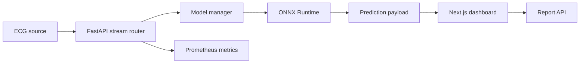

# ECG AI Platform Project Report

## Scope

ECG AI Platform is a portfolio and research demonstration for real-time ECG arrhythmia telemetry. It is production-style software, but it is not a clinical diagnostic device and has not been validated for patient care.

Out of scope: HIPAA/GDPR compliance, medical-device regulatory validation, production hospital deployment, production load testing, full retraining infrastructure, and clinical diagnosis claims.

## System Summary

The platform combines:

- FastAPI REST and WebSocket APIs.
- ONNX Runtime model inference for 360-sample ECG beat windows.
- Optional PyTorch checkpoint loading for Grad-CAM explainability.
- Synthetic and MIT-BIH replay stream sources.
- Prometheus metrics and dashboard summary metrics.
- Next.js dashboard with live waveform rendering, schema-validated stream payloads, reconnect/error states, Grad-CAM modal handling, and PDF report generation.
- Docker Compose, Render, Vercel, and GitHub Actions configuration.

## Architecture

## Model Artifact

The current deployable artifact is:

| Field | Value |
| :--- | :--- |
| Path | `backend/models/ecg_cnn.onnx` |
| SHA-256 | `4d796c63201114a5bfeb128fb32d78da0c13b6b92385682cddf4d7b6260c8c25` |
| Runtime | ONNX Runtime CPU |
| Input shape | `[1, 360]` |
| Classes | `N`, `V`, `A`, `L`, `R` |

The artifact manifest is stored at `backend/models/model_manifest.json`. `MODEL_SHA256` can be set in deployment to fail startup loading if the artifact hash does not match.

## API Contract

Primary public endpoints:

| Method | Endpoint | Status |
| :--- | :--- | :--- |
| `GET` | `/health` | Implemented |
| `GET` | `/metrics` | Implemented, auth-gated when `METRICS_AUTH_TOKEN` is set |
| `GET` | `/metrics/dashboard` | Implemented, auth-gated when `METRICS_AUTH_TOKEN` is set |
| `POST` | `/analyze` | Implemented with fixed 360-sample validation |
| `POST` | `/explain` | Implemented, returns 503 when Grad-CAM is unavailable |
| `POST` | `/report/generate` | Implemented with payload size limits and optional Bearer auth |
| `GET` | `/report/session/{id}/json` | Implemented with optional Bearer auth |
| `WS` | `/ws/ecg-stream` | Implemented with origin and query validation |

The frontend mirrors stream and explainability payloads with `zod` schemas in `frontend/lib/schemas.ts`.

## Security And Resilience

Implemented safeguards:

- CORS origin allowlist from `ALLOWED_ORIGINS`.
- WebSocket origin validation against the same allowlist.
- Query allowlists for stream mode, synthetic pattern, and MIT-BIH record IDs.
- Fixed input length and finite-number validation for `/analyze` and `/explain`.
- Metrics Basic Auth when `METRICS_AUTH_TOKEN` is configured.
- Report Bearer Auth when `REPORT_AUTH_TOKEN` is configured.
- Maximum anomaly-event and image-byte limits for report generation.
- Graceful backend `model_unavailable` health state when the model cannot load.
- Frontend reconnect, malformed payload, backend offline, and explainability unavailable states.

## Verification

Verified in this workspace:

| Area | Command | Result |
| :--- | :--- | :--- |
| Frontend install | `npm ci` | Passed |
| Frontend lint | `npm run lint` | Passed |
| Frontend typecheck | `npm run typecheck` | Passed |
| Frontend tests | `npm test -- --runInBand` | Passed, 26 tests |
| Frontend build | `npm run build` | Passed |
| Frontend audit | `npm audit --audit-level=moderate` | Passed |
| Backend tests | `docker run ... pytest --cov=. --cov-fail-under=80` | Passed, 39 tests, 80.05% coverage |
| Backend syntax | `py -m compileall backend` | Passed |
| Compose config | `docker compose config` | Passed |

The full backend image rebuild timed out locally while resolving heavy ML dependencies, but the existing Python 3.10 backend image successfully ran the current backend source via bind mount.

## Performance Claims

No static MIT-BIH accuracy, F1, or latency numbers are claimed in this report. Those numbers must be generated from:

- `backend/scripts/evaluate_mitbih.py`
- `backend/scripts/benchmark_inference.py`
- `backend/scripts/system_benchmark.py`
- `backend/scripts/run_ablation.py`

Acceptance targets are documented in `docs/benchmarks.md`.

## Deployment Readiness

The repository is configured for:

- Local Docker Compose development.
- Render backend deployment through `render.yaml`.
- Vercel frontend deployment through `frontend/vercel.json`.
- GitHub Actions CI for backend tests, frontend lint/typecheck/tests/build.

Production deployment must set real secrets for `METRICS_AUTH_TOKEN` and `REPORT_AUTH_TOKEN`, production `ALLOWED_ORIGINS`, and browser-facing `NEXT_PUBLIC_API_URL` and `NEXT_PUBLIC_WS_URL`.

## Remaining Work

- Generate and publish MIT-BIH split, leakage-check, accuracy, F1, latency, and throughput artifacts.
- Add a Playwright smoke test that verifies dashboard load, WebSocket connection, `/analyze`, and PDF generation.
- Replace in-memory report session storage with durable storage if report retrieval must survive process restart.
- Decide whether public report generation should remain unauthenticated for demos or move behind a real user-auth flow.

## Disclaimer

This project is educational software. It is not intended for clinical diagnosis, treatment, triage, or patient monitoring.
